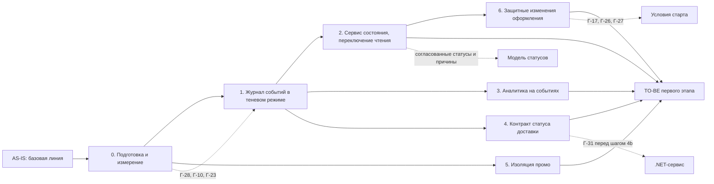

# migration-roadmap.md — roadmap инкрементальной миграции RetailCore

> Назначение документа: показать безопасный путь от AS-IS к TO-BE первого этапа через промежуточные состояния, зависимости, риски, условия остановки и критерии завершения этапов.

Точки трансформации ТТ-1…ТТ-6 и целевое состояние описаны в `transformation.md`, пробелы Г-xx — в `requirements.md`, `architecture-canvas.md` и `transformation.md`. Ключевой переход этапа 2 расписан в `cutover-plan.md`.

## 0. Паспорт roadmap

| Поле | Значение |
|---|---|
| Название проекта | Трансформация платформы RetailCore, первый этап |
| Связанный документ трансформации | `transformation.md` |
| Горизонт планирования | TO-BE первого этапа: промежуточное состояние в пределах года, к запуску новых сервисов. Этап 0 совпадает с трёхмесячным горизонтом получения картины состояния |
| Выбранная стратегия миграции | Incremental Migration с локальным Parallel Run для чтения состояния, аналитических показателей и расчёта скидки |
| Ключевые паттерны | Event-Driven (журнал бизнес-событий), Strangler Fig (постепенное вытеснение пути чтения из Oracle), ACL (перевод статусов монолита и партнёров, слой логистических интеграций, адаптер промо), Database Decomposition только в объёме первого шага: реестр потребителей и вывод чтения |
| Автор | Архитектор решения |
| Дата | 10.09.2026 |
| Версия | 1.0 |

## 1. Краткое резюме roadmap

Миграция выполняется инкрементально, потому что платформу нельзя останавливать, окна на большую миграцию нет, а путь записи заказа держит деньги, резервы и статусы в одной транзакции монолита. Сначала команда собирает базовую линию метрик и проводит аудит писателей статусов и потребителей Oracle, затем запускает журнал бизнес-событий в теневом режиме, без потребителей. Первым безопасным переходом становится чтение состояния заказа из нового сервиса: сначала для поддержки, потом для личного кабинета. После этого на событиях строится аналитика и перестраиваются логистические интеграции, и только затем начинаются изменения в денежном пути оформления: промо и защитные изменения. Порядок диктуют зависимости: без журнала событий нет сервиса состояния, аналитики и перевода .NET-сервиса; без аудита писателей нельзя выбрать способ захвата изменений; без ответов по границам транзакции и тестам нельзя трогать оформление. Самые рискованные переходы — первое переключение пользовательского чтения на новый контур, перевод .NET-сервиса на события и изменения в оформлении. Для каждого этапа заданы критерии готовности и условия остановки, для ключевых переходов предусмотрены отдельные cutover-планы.

## 2. Стартовое и целевое состояние

| Состояние | Описание | Ключевые ограничения | Метрики / признаки состояния |
|---|---|---|---|
| AS-IS | Монолит оркестрирует оформление синхронными вызовами; статусы пишут четыре механизма; аналитика и BI читают операционную Oracle; логистика интегрирована по-разному; .NET читает staging-таблицу | Нет базовой линии метрик, нет реестра потребителей Oracle, фактическая модель статусов не известна | Базовая линия собирается на этапе 0 |
| Промежуточное состояние 1 (после этапа 1) | Журнал бизнес-событий работает в теневом режиме и сверяется с Oracle; поведение системы для всех пользователей не изменилось | Потребителей событий в продуктиве нет; `correlation_id` совпадает с `order_id` | Полнота журнала по сверке, задержка события, нагрузка на Oracle от захвата |
| Промежуточное состояние 2 (после этапа 2) | Поддержка и личный кабинет читают состояние и историю заказа из сервиса состояния; старое чтение сохранено как резерв | Запись статусов не изменилась; письма клиентам по-прежнему формирует монолит | Расхождения состояния вне окна задержки, обращения «что с заказом», время обработки обращения |
| Промежуточное состояние 3 (после этапов 3 и 4) | Самые тяжёлые выгрузки идут из аналитического хранилища; часть логистических партнёров за единым контрактом статуса доставки; .NET-сервис получает заказы из событий | Лёгкие выборки из Oracle остаются; остальные партнёры на старых механизмах | Тяжёлые запросы к Oracle, расхождения показателей, дубли заявок у партнёров, ручные разборы |
| TO-BE первого этапа | Все потребители чтения переключены, старые пути чтения выключены по реестру; промо изолировано; в оформлении есть ключ идемпотентности и компенсация резерва | Путь записи, маршрутизация, оркестрация оплаты, PL/SQL и схема Oracle не менялись | Все метрики раздела 8 не хуже базовой линии, целевые значения согласованы со спонсором |

## 3. Принципы построения roadmap

- **Сначала измеряем, потом меняем:** базовая линия времени оформления по шагам, доли обращений «что с заказом», времени обработки обращения, внутренних эскалаций, дублей заявок у партнёров, ручных разборов в логистике, тяжёлых аналитических запросов к Oracle и доли резервного расчёта скидки собирается до первого изменения (Г-08).
- **Сначала изолируем риск, потом расширяем сценарий:** на первых этапах меняется только путь чтения; денежный путь оформления трогаем последним и только за переключателями.
- **Сначала управляемый пилот, потом масштабирование:** каждый потребитель переключается долей (группа операторов, доля клиентов, одна выгрузка, один партнёр) и расширяется по критериям стабилизации.
- **Сначала модель состояний, потом коммуникация:** клиентские статусы и причины отклонения согласуются с поддержкой и сверяются с текстами писем до того, как клиент их увидит.
- **Сначала реестр потребителей данных, потом декомпозиция:** до выбора способа захвата изменений и до вывода чтения составляется реестр тех, кто пишет и читает таблицы заказа, статусов и staging (Г-10, Г-23, Г-28).
- **Одно продуктивное переключение за окно:** два переключения не выполняются одновременно, чтобы источник проблемы был однозначен.
- **Переключения вне периодов пиковой нагрузки и запрета изменений:** календарь этих периодов нужно получить на этапе 0 (Г-15).

## 4. Roadmap миграции

| Этап | Цель | Промежуточное состояние | Основные работы | Зависимости | Риски | Критерии завершения |
|---|---|---|---|---|---|---|
| AS-IS | Зафиксировать стартовую точку | Текущее поведение описано в `as-is-context.md` | Описание устройства, проблемных зон, пробелов | — | Неизвестные писатели и потребители Oracle | Проблемные зоны и пробелы зафиксированы |
| 0. Подготовка и измерение | Получить базовую линию и данные для выбора решений | Функционально система не меняется; появляются метрики и журналирование пути расчёта скидки | Базовая линия метрик; аудит писателей статусов и потребителей Oracle; фактическая модель статусов по журналу переходов; реестр логистических партнёров; оценка мощностей и брокера; назначение владельца контракта событий; согласование канонического набора событий, клиентских статусов и причин; журналирование пути расчёта скидки без изменения логики | Доступ к логам, мониторингу Oracle, обращениям поддержки | Базовую линию невозможно собрать по части метрик; аудит пропустит скрытых потребителей | Базовая линия подтверждена эксплуатацией и поддержкой; способ захвата изменений выбран; контракт событий v1 утверждён владельцем; мощности выделены; ответы по Г-06, Г-15, Г-28, Г-29, Г-30, Г-32 получены |
| 1. Журнал событий в теневом режиме (ТТ-1) | Получить полный и своевременный поток бизнес-событий без влияния на пользователей | Промежуточное состояние 1 | Развернуть захват изменений и брокер; публиковать события по контракту v1; запустить сверку журнала с таблицей истории статусов | Этап 0 | Захват пропускает изменения из пакетных процедур и админки; рост нагрузки на Oracle | За период наблюдения, включающий день с нагрузкой не ниже типичного пика по базовой линии, сверка не выявила пропущенных изменений; задержка события в пределах Г-06; нагрузка на Oracle в пределах, согласованных с эксплуатацией |
| 2. Сервис состояния и переключение чтения (ТТ-2) | Дать поддержке и клиенту одну картину заказа | Промежуточное состояние 2 | 2a: сервис состояния, слой перевода статусов, загрузка истории активных заказов, теневое сравнение со старым чтением. 2b: переключение пилотной группы операторов, затем всей поддержки. 2c: переключение личного кабинета для доли клиентов, затем для всех | Этап 1; согласованные клиентские статусы и причины; перевод специальных статусов партнёров (Г-25) | Задержка модели чтения создаёт новое расхождение; клиентские статусы не совпадают с текстами писем; неверный перевод специальных статусов | Нет расхождений состояния вне окна задержки; обращения «что с заказом» и время обработки обращения не хуже базовой линии за период стабилизации; реестр переключённых потребителей ведётся |
| 3. Аналитика на событиях (ТТ-3) | Одна цифра для функций бизнеса, меньше нагрузки на Oracle | Часть промежуточного состояния 3 | Аналитическое хранилище; согласованные определения отмены, возврата, промо и выручки; параллельный расчёт двух-трёх самых тяжёлых выгрузок и одного спорного показателя выручки; переключение этих выгрузок | Этап 1; реестр аналитических потребителей Oracle; согласие маркетинга, финансов и операций на определения | Цифры не сойдутся со старыми; ретроактивные корректировки не попадут в события | Расхождения показателей между старым и новым расчётом объяснены и приняты владельцами функций; тяжёлые запросы к Oracle сократились относительно базовой линии; время ответа оформления в окна выгрузок не хуже базовой линии |
| 4. Контракт статуса доставки (ТТ-4) | Меньше ручных разборов и дублей в логистике | Часть промежуточного состояния 3 | 4a: слой перевода для первого партнёра с асинхронными подтверждениями, идемпотентный приём, события доставки, журнал изменений настроек. 4b: перевод .NET-сервиса с INT_ORDER_EXPORT на событие «заказ подтверждён». 4c: остальные партнёры по одному | Этап 1; реестр партнёров (Г-22); ответ владельца .NET-сервиса (Г-31) | Слой перевода обрастает бизнес-логикой; .NET-сценарии ломаются при смене момента экспорта; недооценка исключений партнёров | По каждому переведённому партнёру дубли заявок и ручные разборы не выше базовой линии; потерянных заявок нет по сверке; .NET-сервис обработал все подтверждённые заказы из событий |
| 5. Изоляция промо (ТТ-5) | Одна сумма заказа независимо от пути расчёта, быстрый запуск акций | Промо за адаптером с явным результатом, новые механики только в промо-сервисе | Адаптер с результатами «скидка есть / скидки нет / сервис недоступен»; резервный расчёт только при недоступности; параллельная сверка резервного и основного расчёта; заморозка `legacy_promo_pkg` | Этап 0 (данные журналирования пути расчёта); ответ по Г-19; маркетинг как владелец правил | Изменение трактовки пустого ответа меняет суммы действующих акций | Доля резервного расчёта и расхождение скидки измерены и приняты маркетингом; конверсия оформления не хуже базовой линии; новых правил в `legacy_promo_pkg` не добавлено |
| 6. Защитные изменения оформления (ТТ-6) | Убрать дубли заказов и висящие резервы доставки | Ключ идемпотентности и компенсация резерва включены за переключателями | Ключ идемпотентности на входе оформления по каналам; снятие резерва доставки при сбое оплаты; передача `correlation_id` в вызовы оформления | Ответы по Г-17, Г-26, Г-27; стабильность этапа 2 | Регрессия в оформлении; партнёр не поддерживает отмену резерва | Доля дублей заказов и число висящих резервов снизились относительно базовой линии; конверсия оформления и время ответа не хуже базовой линии |
| TO-BE первого этапа | Проверить достижение целевого состояния | TO-BE из раздела 2 | Отключить старые пути чтения по реестру; финальная сверка метрик; решения по следующему горизонту | Этапы 1–6 | Остаточные риски раздела 7 | Метрики раздела 8 не хуже базовой линии, целевые значения достигнуты или пересмотрены со спонсором |

## 5. Детализация этапов

### Этап 0. Подготовка и измерение

| Раздел | Содержание |
|---|---|
| Цель этапа | Получить базовую линию и данные, без которых нельзя выбрать способ захвата изменений и доказать эффект следующих этапов |
| Какие точки трансформации закрывает | Подготовка ко всем; первый шаг ТТ-5 (журналирование пути расчёта скидки) |
| Что меняется в процессе | Поддержка размечает обращения по причинам; операционный блок фиксирует ручные разборы в логистике |
| Что меняется в архитектуре | Журналирование пути расчёта скидки в монолите; метрики времени оформления по шагам |
| Что не меняется | Логика оформления, статусов, интеграций |
| Входные условия | Доступ к логам, мониторингу Oracle, CRM поддержки |
| Выходные условия | Базовая линия подтверждена; реестр писателей и потребителей таблиц заказа, статусов и staging; фактическая модель статусов; способ захвата изменений выбран; контракт событий v1 утверждён; мощности и брокер определены |
| Метрики этапа | Полнота базовой линии по списку метрик раздела 3 |
| Риски этапа | Часть метрик невозможно собрать из текущих источников; аудит не найдёт ночные скрипты |
| Условие остановки | Базовую линию по обращениям и дублям подтвердить невозможно: этап продлевается, этап 2 не начинается |

### Этап 1. Журнал событий в теневом режиме

| Раздел | Содержание |
|---|---|
| Цель этапа | Получить полный поток бизнес-событий заказа без влияния на пользователей |
| Какие точки трансформации закрывает | ТТ-1 |
| Что меняется в процессе | Ничего |
| Что меняется в архитектуре | Захват изменений заказа, брокер с каноническим контрактом событий, сверка журнала с Oracle |
| Что не меняется | Путь записи заказа, все существующие потребители |
| Входные условия | Выходные условия этапа 0 |
| Выходные условия | Сверка без пропусков за период с пиковой нагрузкой; задержка в пределах Г-06; нагрузка на Oracle в пределах, согласованных с эксплуатацией |
| Метрики этапа | Доля изменений, попавших в журнал; задержка события; нагрузка на Oracle от захвата; повторы событий |
| Риски этапа | Пропуск изменений из пакетных процедур; рост нагрузки на Oracle |
| Условие остановки | Нагрузка на Oracle выше согласованного порога: захват отключается. Систематические пропуски изменений: этап 2 не начинается до исправления |

### Этап 2. Сервис состояния и переключение чтения

| Раздел | Содержание |
|---|---|
| Цель этапа | Дать поддержке и клиенту одно состояние заказа с понятным статусом, причиной отклонения и историей |
| Какие точки трансформации закрывает | ТТ-2 |
| Что меняется в процессе | Операторы работают с новым экраном состояния; ручные действия по-прежнему через админку монолита |
| Что меняется в архитектуре | Сервис состояния, слой перевода статусов, переключатели чтения в инструментах поддержки и в личном кабинете |
| Что не меняется | Запись статусов, уведомления клиентам, административные действия |
| Входные условия | Выходные условия этапа 1; клиентские статусы и причины согласованы с поддержкой и сверены с текстами писем; перевод специальных статусов проверен |
| Выходные условия | Нет расхождений вне окна задержки; обращения и время обработки не хуже базовой линии; старое чтение сохранено как резерв с условием отключения |
| Метрики этапа | Расхождения состояния; задержка модели чтения; обращения «что с заказом»; время обработки обращения; внутренние эскалации |
| Риски этапа | Задержка модели чтения; противоречие между статусом в ЛК и текстом письма; неверный перевод специальных статусов |
| Условие остановки | Расхождение состояния вне окна задержки у решающих статусов (подтверждён, оплачен, отменён, доставлен) или рост обращений «что с заказом» выше базовой линии: переключение откатывается по `cutover-plan.md` |

### Этап 3. Аналитика на событиях

| Раздел | Содержание |
|---|---|
| Цель этапа | Одна цифра по выручке кампании и меньше нагрузки на Oracle |
| Какие точки трансформации закрывает | ТТ-3 |
| Что меняется в процессе | Маркетинг, финансы и операции берут выбранные показатели из новых витрин |
| Что меняется в архитектуре | Аналитическое хранилище; выбранные выгрузки читают его вместо Oracle |
| Что не меняется | Лёгкие выборки из Oracle, BI-инструменты |
| Входные условия | Выходные условия этапа 1; определения показателей согласованы владельцами функций |
| Выходные условия | Расхождения старого и нового расчёта объяснены и приняты; тяжёлые запросы к Oracle сократились |
| Метрики этапа | Расхождения показателей; тяжёлые запросы к Oracle; время ответа оформления в окна выгрузок |
| Риски этапа | Функции не примут новые цифры; корректировки задним числом не попадут в события |
| Условие остановки | Расхождение не удаётся объяснить: выгрузка остаётся на старом источнике |

### Этап 4. Контракт статуса доставки

| Раздел | Содержание |
|---|---|
| Цель этапа | Меньше ручных разборов и дублей заявок у партнёров |
| Какие точки трансформации закрывает | ТТ-4 |
| Что меняется в процессе | Изменения настроек приоритетов фиксируются с автором и временем |
| Что меняется в архитектуре | Слой перевода для партнёров, события доставки, вход .NET-сервиса из события подтверждения |
| Что не меняется | Логика выбора маршрута, синхронный резерв слота при оформлении |
| Входные условия | Выходные условия этапа 1; реестр партнёров; ответ по Г-31 до шага 4b |
| Выходные условия | Все партнёры из реестра переведены или по каждому зафиксировано обоснованное исключение |
| Метрики этапа | Дубли заявок; ручные разборы; время до подтверждения партнёром; доля заказов с изменённым сроком |
| Риски этапа | Слой перевода обрастает бизнес-логикой; .NET-сценарии ломаются |
| Условие остановки | Потерянные или продублированные заявки у переведённого партнёра: партнёр возвращается на старый механизм |

### Этап 5. Изоляция промо

| Раздел | Содержание |
|---|---|
| Цель этапа | Одна сумма заказа независимо от пути расчёта и запуск новых акций только в промо-сервисе |
| Какие точки трансформации закрывает | ТТ-5 |
| Что меняется в процессе | Маркетинг заводит новые механики только в промо-сервисе |
| Что меняется в архитектуре | Адаптер промо в монолите; резервный расчёт только при недоступности; параллельная сверка |
| Что не меняется | Базовый расчёт цены, сервисный сбор маркетплейса, региональные надбавки |
| Входные условия | Данные журналирования этапа 0; ответ по Г-19; согласие маркетинга |
| Выходные условия | Расхождение скидки между путями измерено и принято; новых правил в `legacy_promo_pkg` нет |
| Метрики этапа | Доля резервного расчёта; расхождение скидки; конверсия оформления; время запуска акции |
| Риски этапа | Изменение сумм действующих акций |
| Условие остановки | Конверсия оформления ниже базовой линии или жалобы на сумму заказа: переключатель адаптера возвращает прежнее поведение |

### Этап 6. Защитные изменения оформления

| Раздел | Содержание |
|---|---|
| Цель этапа | Убрать дубли заказов и висящие резервы доставки |
| Какие точки трансформации закрывает | ТТ-6 |
| Что меняется в процессе | Поддержка получает меньше обращений о двойных заказах |
| Что меняется в архитектуре | Ключ идемпотентности на входе оформления; компенсация резерва доставки; передача `correlation_id` |
| Что не меняется | Порядок шагов оформления, транзакция, оркестрация оплаты |
| Входные условия | Ответы по Г-17, Г-26, Г-27; стабильность этапа 2 |
| Выходные условия | Дубли и висящие резервы снизились; конверсия не хуже базовой линии |
| Метрики этапа | Доля дублей заказов; висящие резервы; конверсия; время ответа оформления |
| Риски этапа | Регрессия в оформлении |
| Условие остановки | Конверсия или время ответа оформления хуже базовой линии: переключатель выключается |

## 6. Зависимости между этапами

### 6.1. Таблица зависимостей

| Зависимость | Почему порядок жёсткий | Что будет, если нарушить порядок | Как контролируем |
|---|---|---|---|
| Этап 0 до этапа 1 | Способ захвата изменений выбирается по аудиту писателей статусов | Журнал пропустит изменения пакетных процедур или админки | Реестр писателей утверждён техлидом монолита |
| Этап 1 до этапов 2, 3, 4 | Сервис состояния, аналитика и .NET-сервис потребляют события | Потребители получат неполные данные, расхождения попадут к клиентам и в отчёты | Выходные критерии этапа 1 |
| Этап 0 до этапа 2 | Без базовой линии обращений нельзя понять, стало ли лучше или хуже | Переключение не с чем сравнить, условие остановки не работает | Базовая линия подтверждена поддержкой |
| Этап 2 до этапа 6 | Изменения оформления нужно наблюдать через новый контур состояния | Регрессия в оформлении останется незамеченной до обращений клиентов | Этап 6 начинается только после стабилизации этапа 2 |
| Этапы 2, 3, 4 можно вести параллельно после этапа 1 | Разные потребители событий, разные команды | Одновременные переключения затрудняют поиск причины сбоя | Правило «одно продуктивное переключение за окно» |
| Этап 5 можно вести параллельно с этапами 1–4 | Не зависит от событий, опирается на данные этапа 0 | Переключение адаптера в одно окно с другим переключением | Правило «одно продуктивное переключение за окно» |

## 7. Управление рисками roadmap

| Этап | Риск | Вероятность | Влияние | Контроль | Условие остановки | Владелец |
|---|---|---:|---:|---|---|---|
| 0 | Базовую линию по части метрик собрать нельзя | Средняя | Высокое | Сверка нескольких источников: логи, CRM поддержки, мониторинг Oracle | Метрика без источника: этапы, которые она проверяет, не начинаются | Архитектор, эксплуатация |
| 0 | Аудит не найдёт ночные скрипты и скрытых потребителей | Средняя | Высокое | Аудит обращений к таблицам Oracle за период, включающий ночные окна | Обнаружен неучтённый писатель статусов после старта этапа 1: этап 1 возвращается к выбору способа захвата | Техлид монолита (Андрей) |
| 1 | Захват изменений пропускает записи | Средняя | Высокое | Постоянная сверка журнала с таблицей истории статусов | Пропуски по сверке: этап 2 не начинается | Владелец контракта событий |
| 1 | Захват нагружает Oracle | Средняя | Высокое | Мониторинг нагрузки Oracle, отдельный алерт | Нагрузка выше порога эксплуатации: захват отключается | Эксплуатация |
| 2 | Задержка модели чтения создаёт новое расхождение | Средняя | Высокое | Теневое сравнение, показ времени последнего обновления | Расхождение вне окна задержки у решающих статусов: откат | Руководитель переключения |
| 2 | Статус в личном кабинете противоречит тексту письма | Высокая | Среднее | Сверка клиентских статусов с текстами писем до переключения | Жалобы клиентов на противоречие: откат личного кабинета | Руководитель поддержки (Ольга) |
| 2 | Неверный перевод специальных статусов маркетплейсов и партнёра | Средняя | Среднее | Выборочная проверка заказов маркетплейсов пилотной группой | Неверный статус у заказа маркетплейса: откат для канала маркетплейсов | Техлид монолита (Андрей) |
| 3 | Новые цифры не принимаются функциями | Средняя | Среднее | Параллельный расчёт, согласование определений | Необъяснённое расхождение: выгрузка остаётся на Oracle | Разработчик аналитики (Максим) |
| 4 | Слой перевода обрастает бизнес-логикой | Средняя | Среднее | Ревью ответственности слоя на каждом партнёре | Решение о маршруте появилось в слое перевода: доработка останавливается до ревью | Разработчик логистики (Ирина) |
| 4 | .NET-сценарии ломаются при смене момента экспорта | Не известна до ответа по Г-31 | Высокое | Отдельный cutover-план, параллельная работа старого экспорта | Заказ не дошёл до партнёра через .NET: возврат на INT_ORDER_EXPORT | Владелец .NET-сервиса |
| 5 | Меняются суммы действующих акций | Средняя | Высокое | Параллельная сверка до переключения, переключатель на долю трафика | Конверсия ниже базовой линии: переключатель выключается | Маркетинг, техлид монолита |
| 6 | Регрессия в оформлении | Средняя | Высокое | Старт только после Г-17, Г-26, Г-27; переключатель по каналам | Конверсия или время ответа хуже базовой линии: переключатель выключается | Техлид монолита, бизнес-владелец (Дмитрий) |
| Все | Затянутое сосуществование старого и нового чтения | Высокая | Среднее | Реестр переключённых потребителей, условие отключения старого пути | Старый путь чтения живёт после завершения этапа без решения: вопрос выносится спонсору | Архитектор |
| Все | Новые компоненты не помещаются в мощности ДЦ | Средняя | Высокое | Оценка мощностей на этапе 0 (Г-29) | Нет выделенных мощностей: этап 1 не начинается | Эксплуатация и инфраструктура |

## 8. Метрики и контрольные точки

Базовые значения собираются на этапе 0. Пороги сформулированы относительно базовой линии или ссылаются на согласуемое значение; целевые значения утверждает спонсор после сбора базовой линии.

| Контрольная точка | Когда проверяем | Что проверяем | Целевой порог | Источник данных | Решение по результату |
|---|---|---|---:|---|---|
| Базовая линия | Конец этапа 0 | Наличие значений по всем метрикам раздела 3 | Все метрики имеют источник и значение | Логи, CRM поддержки, мониторинг Oracle | Продолжить / продлить этап 0 |
| Полнота журнала | Конец этапа 1 | Доля изменений, попавших в журнал | Пропусков нет | Сверка с историей статусов | Продолжить / остановить |
| Задержка журнала | Этап 1 и далее | Время от изменения в Oracle до события | В пределах Г-06 | Метрики захвата и брокера | Продолжить / уточнить |
| Нагрузка захвата | Этап 1 и далее | Нагрузка на Oracle от захвата | В пределах порога эксплуатации | Мониторинг Oracle | Продолжить / отключить захват |
| Согласованность состояния | Этап 2 | Расхождения клиентского статуса и внутреннего состояния с Oracle | Нет расхождений вне окна задержки | Теневое сравнение | Продолжить / откатить |
| Обращения по статусу | Этап 2, период стабилизации | Доля обращений «что с заказом», время обработки обращения | Не выше базовой линии | CRM поддержки | Расширять / остановить / откатить |
| Показатели аналитики | Этап 3 | Расхождения между старым и новым расчётом | Объяснены и приняты владельцами | Сверка отчётов | Переключить выгрузку / оставить на Oracle |
| Нагрузка аналитики на Oracle | Этап 3 | Тяжёлые запросы к операционной Oracle | Ниже базовой линии | Мониторинг Oracle | Продолжить |
| Логистика | Этап 4, по каждому партнёру | Дубли заявок, ручные разборы, потерянные заявки | Потерь нет; дубли и разборы не выше базовой линии | События доставки, журнал разборов | Следующий партнёр / вернуть партнёра |
| Промо | Этап 5 | Доля резервного расчёта, расхождение скидки, конверсия | Конверсия не ниже базовой линии; расхождение принято маркетингом | Журнал пути расчёта | Расширить / выключить переключатель |
| Оформление | Этап 6 | Дубли заказов, висящие резервы, конверсия, время ответа | Дубли и резервы ниже базовой линии; конверсия и время не хуже | События журнала, метрики оформления | Расширить / выключить переключатель |

## 9. Промежуточные состояния

| Промежуточное состояние | Что уже работает | Что ещё остаётся в легаси | Как пользователь видит сценарий | Как поддержка видит сценарий | Основные риски |
|---|---|---|---|---|---|
| 1. Журнал в теневом режиме | Поток бизнес-событий, сверка с Oracle | Всё чтение и вся запись | Без изменений | Без изменений | Нагрузка захвата на Oracle |
| 2. Чтение состояния из нового сервиса | Поддержка и личный кабинет читают сервис состояния; старое чтение в резерве | Запись статусов, письма клиентам, аналитика, логистика | Понятный клиентский статус и время последнего обновления; письма в прежних формулировках | Один экран с шагом, причиной и историей; ручные действия через админку, их результат виден с задержкой | Задержка модели чтения; противоречие статуса и письма |
| 3. Аналитика и логистика на событиях | Тяжёлые выгрузки из хранилища; часть партнёров за контрактом; .NET на событиях | Лёгкие выборки из Oracle; остальные партнёры; путь записи | Меньше изменений срока доставки у переведённых партнёров | Статус доставки в едином формате у переведённых партнёров | Расхождение цифр; поломка .NET-сценариев |
| TO-BE первого этапа | Всё перечисленное плюс изолированное промо и защита оформления | Путь записи, маршрутизация, оркестрация оплаты, PL/SQL, схема Oracle | Одна сумма заказа, нет двойных заказов | Меньше обращений о двойных заказах и висящих резервах | Остаточные риски раздела 7 |

## 10. Связь roadmap с cutover-планами

| Ключевой переход | На каком этапе | Почему нужен отдельный cutover-plan | Связанный файл |
|---|---|---|---|
| Переключение чтения состояния заказа для поддержки и личного кабинета | 2b, 2c | Первый пользовательский потребитель нового контура; ошибка сразу видна клиентам и поддержке; ровно тот риск потери прозрачности, которого боится поддержка | `cutover-plan.md` |
| Перевод .NET-сервиса с INT_ORDER_EXPORT на события | 4b | Меняется момент и источник передачи заказа партнёрам; есть заказы в пути на момент переключения | Отдельный cutover-план, готовится после ответа по Г-31 |
| Изменение трактовки ответа промо-сервиса | 5 | Денежный путь оформления | Отдельный cutover-план |
| Включение ключа идемпотентности и компенсации резерва | 6 | Зона высокого риска, конверсия | Отдельный cutover-план |
| Переключение тяжёлых выгрузок на аналитическое хранилище | 3 | Влияет на управленческие цифры | Можно ограничиться процедурой параллельной сверки по каждой выгрузке |

## 11. Открытые вопросы

| Вопрос | Почему важен | Кто должен ответить | Срок | Что делаем, если ответа нет |
|---|---|---|---|---|
| Допустимая задержка состояния заказа для клиента и поддержки (Г-06) | Порог для этапов 1 и 2 | Руководитель поддержки, спонсор | До конца этапа 0 | Этап 2 не начинается; этап 1 идёт с фиксацией фактической задержки |
| Календарь пиков и периодов запрета изменений (Г-15) | Выбор окон переключения | Эксплуатация, спонсор | До конца этапа 0 | Переключения только в периоды, которые эксплуатация явно подтвердит как низконагруженные |
| Пишут ли все механизмы смены статуса в таблицу истории (Г-28) | Способ захвата изменений | Техлид монолита | До конца этапа 0 | Выбирается захват из журнала изменений БД |
| Доступные мощности ДЦ и брокер (Г-29, Г-30) | Размещение новых компонентов | Эксплуатация и инфраструктура | До конца этапа 0 | Этап 1 не начинается |
| Владелец контракта событий (Г-32) | Без владельца контракт размывается | Спонсор, ИТ | До конца этапа 0 | Этап 1 не начинается |
| Нужны ли .NET-сценариям заказы до подтверждения (Г-31) | Возможность шага 4b | Владелец .NET-сервиса | До начала шага 4b | Шаг 4b не выполняется, .NET остаётся на INT_ORDER_EXPORT |
| Что означает пустой ответ промо-сервиса (Г-19) | Изменение логики этапа 5 | Техлид монолита, маркетинг | До начала этапа 5 | Этап 5 ограничивается журналированием и сверкой |
| Границы транзакции, тесты, отмена резерва у партнёров (Г-17, Г-26, Г-27) | Условия старта этапа 6 | Техлид монолита, логистика | До начала этапа 6 | Этап 6 переносится на следующий горизонт |
| Целевые значения метрик (Г-08) | Признание этапов успешными | Спонсор | После сбора базовой линии | Этапы принимаются по правилу «не хуже базовой линии» |
| Кто руководит переключениями, владеет сервисом состояния и дежурит от эксплуатации (Г-33) | Полномочия на остановку и откат | Спонсор, ИТ, эксплуатация | До окна первого переключения | Переключение не проводится |

## 12. Проверка качества roadmap

- [x] roadmap связан с точками трансформации из `transformation.md`;
- [x] есть стартовое состояние, промежуточные состояния и TO-BE;
- [x] порядок этапов объяснён зависимостями, а не просто перечислен;
- [x] для каждого этапа указаны цель, работы, риски и критерии завершения;
- [x] риски имеют контроль и условия остановки;
- [x] метрики позволяют понять, стало ли лучше;
- [x] ключевой рискованный переход вынесен в отдельный `cutover-plan.md`;
- [x] roadmap не требует «идеального будущего» для запуска первого полезного этапа.
